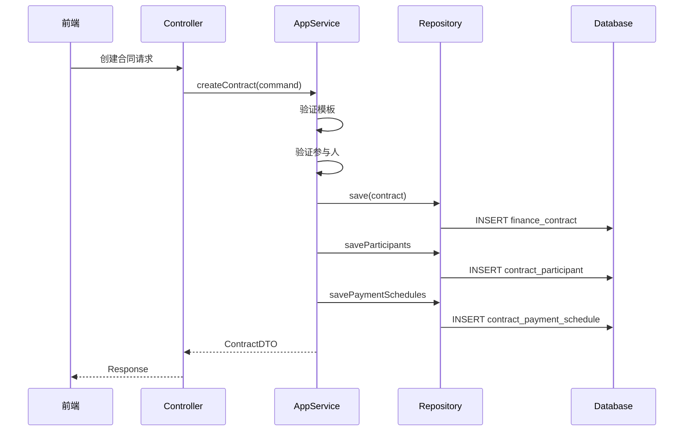

# Design Document: 合同模块完善

## Overview

本设计文档描述智慧律所管理系统中合同管理模块的完善方案。采用渐进式重构策略，在保持现有 `finance_contract` 表结构的基础上扩展字段，并新增付款计划和合同参与人两个子表。

### 设计目标

1. 完善合同信息记录，支持诉讼案件的完整信息
2. 支持分期付款计划管理
3. 支持合同参与人及提成比例管理
4. 实现合同与项目的强关联
5. 保持与现有财务模块的兼容性

## Architecture

### 模块架构

```
┌─────────────────────────────────────────────────────────────┐
│                      Interfaces Layer                        │
│  ┌─────────────────┐  ┌─────────────────┐                   │
│  │ContractController│  │PaymentSchedule  │                   │
│  │                 │  │Controller       │                   │
│  └────────┬────────┘  └────────┬────────┘                   │
└───────────┼────────────────────┼────────────────────────────┘
            │                    │
┌───────────┼────────────────────┼────────────────────────────┐
│           │   Application Layer│                            │
│  ┌────────▼────────┐  ┌────────▼────────┐                   │
│  │ContractAppService│  │PaymentSchedule  │                   │
│  │                 │  │AppService       │                   │
│  └────────┬────────┘  └────────┬────────┘                   │
└───────────┼────────────────────┼────────────────────────────┘
            │                    │
┌───────────┼────────────────────┼────────────────────────────┐
│           │    Domain Layer    │                            │
│  ┌────────▼────────┐  ┌────────▼────────┐  ┌──────────────┐│
│  │    Contract     │  │PaymentSchedule  │  │Contract      ││
│  │    (Entity)     │  │(Entity)         │  │Participant   ││
│  └────────┬────────┘  └────────┬────────┘  └──────┬───────┘│
│           │                    │                   │        │
│  ┌────────▼────────┐  ┌────────▼────────┐  ┌──────▼───────┐│
│  │ContractRepository│ │PaymentSchedule  │  │Participant   ││
│  │                 │  │Repository       │  │Repository    ││
│  └─────────────────┘  └─────────────────┘  └──────────────┘│
└─────────────────────────────────────────────────────────────┘
```

### 数据流



## Components and Interfaces

### 1. Contract Entity (扩展)

```java
@TableName("finance_contract")
public class Contract extends BaseEntity {
    // 现有字段...
    
    // 新增字段
    private String trialStage;           // 审理阶段
    private BigDecimal claimAmount;      // 标的金额
    private String jurisdictionCourt;    // 管辖法院
    private String opposingParty;        // 对方当事人
    private String conflictCheckStatus;  // 利冲审查状态
    private String archiveStatus;        // 归档状态
    private BigDecimal advanceTravelFee; // 预支差旅费
    private BigDecimal riskRatio;        // 风险代理比例
    private String sealRecord;           // 印章记录(JSON)
}
```

### 2. ContractPaymentSchedule Entity (新增)

```java
@TableName("contract_payment_schedule")
public class ContractPaymentSchedule extends BaseEntity {
    private Long contractId;        // 合同ID
    private String phaseName;       // 阶段名称
    private BigDecimal amount;      // 金额
    private BigDecimal percentage;  // 比例(风险代理)
    private LocalDate plannedDate;  // 计划收款日期
    private LocalDate actualDate;   // 实际收款日期
    private String status;          // 状态
    private String remark;          // 备注
}
```

### 3. ContractParticipant Entity (新增)

```java
@TableName("contract_participant")
public class ContractParticipant extends BaseEntity {
    private Long contractId;           // 合同ID
    private Long userId;               // 用户ID
    private String role;               // 角色
    private BigDecimal commissionRate; // 提成比例
    private String remark;             // 备注
}
```

### 4. API Interfaces

#### 合同管理 API

| Method | Path | Description |
|--------|------|-------------|
| GET | /matter/contract | 合同列表 |
| GET | /matter/contract/{id} | 合同详情 |
| POST | /matter/contract | 创建合同 |
| PUT | /matter/contract/{id} | 更新合同 |
| POST | /matter/contract/{id}/submit | 提交审批 |
| POST | /matter/contract/{id}/approve | 审批通过 |
| POST | /matter/contract/{id}/reject | 审批拒绝 |

#### 付款计划 API

| Method | Path | Description |
|--------|------|-------------|
| GET | /matter/contract/{id}/payment-schedules | 付款计划列表 |
| POST | /matter/contract/{id}/payment-schedules | 添加付款计划 |
| PUT | /matter/contract/{id}/payment-schedules/{scheduleId} | 更新付款计划 |
| DELETE | /matter/contract/{id}/payment-schedules/{scheduleId} | 删除付款计划 |

#### 合同参与人 API

| Method | Path | Description |
|--------|------|-------------|
| GET | /matter/contract/{id}/participants | 参与人列表 |
| POST | /matter/contract/{id}/participants | 添加参与人 |
| PUT | /matter/contract/{id}/participants/{participantId} | 更新参与人 |
| DELETE | /matter/contract/{id}/participants/{participantId} | 删除参与人 |

## Data Models

### 数据库表结构

#### finance_contract 表扩展字段

```sql
ALTER TABLE finance_contract ADD COLUMN IF NOT EXISTS trial_stage VARCHAR(50);
ALTER TABLE finance_contract ADD COLUMN IF NOT EXISTS claim_amount DECIMAL(15,2);
ALTER TABLE finance_contract ADD COLUMN IF NOT EXISTS jurisdiction_court VARCHAR(200);
ALTER TABLE finance_contract ADD COLUMN IF NOT EXISTS opposing_party VARCHAR(200);
ALTER TABLE finance_contract ADD COLUMN IF NOT EXISTS conflict_check_status VARCHAR(20) DEFAULT 'NOT_REQUIRED';
ALTER TABLE finance_contract ADD COLUMN IF NOT EXISTS archive_status VARCHAR(20) DEFAULT 'NOT_ARCHIVED';
ALTER TABLE finance_contract ADD COLUMN IF NOT EXISTS advance_travel_fee DECIMAL(15,2);
ALTER TABLE finance_contract ADD COLUMN IF NOT EXISTS risk_ratio DECIMAL(5,2);
ALTER TABLE finance_contract ADD COLUMN IF NOT EXISTS seal_record TEXT;
```

#### contract_payment_schedule 表

```sql
CREATE TABLE IF NOT EXISTS contract_payment_schedule (
    id BIGSERIAL PRIMARY KEY,
    contract_id BIGINT NOT NULL,
    phase_name VARCHAR(100) NOT NULL,
    amount DECIMAL(15,2) NOT NULL,
    percentage DECIMAL(5,2),
    planned_date DATE,
    actual_date DATE,
    status VARCHAR(20) DEFAULT 'PENDING',
    remark VARCHAR(500),
    created_at TIMESTAMP DEFAULT CURRENT_TIMESTAMP,
    updated_at TIMESTAMP DEFAULT CURRENT_TIMESTAMP,
    created_by BIGINT,
    updated_by BIGINT,
    deleted BOOLEAN DEFAULT FALSE,
    CONSTRAINT fk_payment_schedule_contract FOREIGN KEY (contract_id) REFERENCES finance_contract(id)
);

CREATE INDEX idx_payment_schedule_contract ON contract_payment_schedule(contract_id);
CREATE INDEX idx_payment_schedule_status ON contract_payment_schedule(status);
```

#### contract_participant 表

```sql
CREATE TABLE IF NOT EXISTS contract_participant (
    id BIGSERIAL PRIMARY KEY,
    contract_id BIGINT NOT NULL,
    user_id BIGINT NOT NULL,
    role VARCHAR(20) NOT NULL,
    commission_rate DECIMAL(5,2),
    remark VARCHAR(500),
    created_at TIMESTAMP DEFAULT CURRENT_TIMESTAMP,
    updated_at TIMESTAMP DEFAULT CURRENT_TIMESTAMP,
    created_by BIGINT,
    updated_by BIGINT,
    deleted BOOLEAN DEFAULT FALSE,
    CONSTRAINT fk_participant_contract FOREIGN KEY (contract_id) REFERENCES finance_contract(id),
    CONSTRAINT fk_participant_user FOREIGN KEY (user_id) REFERENCES sys_user(id),
    UNIQUE(contract_id, user_id)
);

CREATE INDEX idx_participant_contract ON contract_participant(contract_id);
CREATE INDEX idx_participant_user ON contract_participant(user_id);
```

### 枚举定义

```java
// 审理阶段
public enum TrialStage {
    FIRST_INSTANCE,    // 一审
    SECOND_INSTANCE,   // 二审
    RETRIAL,           // 再审
    EXECUTION,         // 执行
    NON_LITIGATION     // 非诉
}

// 利冲审查状态
public enum ConflictCheckStatus {
    PENDING,       // 待审查
    PASSED,        // 已通过
    FAILED,        // 未通过
    NOT_REQUIRED   // 无需审查
}

// 归档状态
public enum ArchiveStatus {
    NOT_ARCHIVED,  // 未归档
    ARCHIVED,      // 已归档
    DESTROYED      // 已销毁
}

// 付款计划状态
public enum PaymentScheduleStatus {
    PENDING,    // 待收
    PARTIAL,    // 部分收款
    PAID,       // 已收清
    CANCELLED   // 已取消
}

// 合同参与人角色
public enum ContractParticipantRole {
    LEAD,        // 承办律师
    CO_COUNSEL,  // 协办律师
    ORIGINATOR,  // 案源人
    PARALEGAL    // 律师助理
}
```

## Correctness Properties

*A property is a characteristic or behavior that should hold true across all valid executions of a system-essentially, a formal statement about what the system should do. Properties serve as the bridge between human-readable specifications and machine-verifiable correctness guarantees.*

### Property 1: Contract Data Round-Trip

*For any* valid contract with all extended fields (trial_stage, claim_amount, jurisdiction_court, opposing_party, conflict_check_status, archive_status, advance_travel_fee, risk_ratio, seal_record), saving to database and retrieving should produce an equivalent contract object.

**Validates: Requirements 1.1, 1.2, 1.3, 1.4, 1.5, 1.6, 1.7, 1.8, 1.9**

### Property 2: Payment Schedule Data Round-Trip

*For any* valid payment schedule with all fields (phase_name, amount, percentage, planned_date, actual_date, status), saving to database and retrieving should produce an equivalent payment schedule object.

**Validates: Requirements 2.2, 2.3, 2.4, 2.5, 2.6, 2.7**

### Property 3: Multiple Payment Schedules Per Contract

*For any* contract, the system should allow creating multiple payment schedule entries, and all entries should be retrievable by contract_id.

**Validates: Requirements 2.1**

### Property 4: Payment Schedule Total Validation

*For any* contract with payment schedules, the sum of all payment schedule amounts should equal the contract's total_amount (within acceptable tolerance for rounding).

**Validates: Requirements 2.9**

### Property 5: Risk Ratio Range Validation

*For any* contract, the risk_ratio field should only accept values between 0 and 100 (inclusive). Values outside this range should be rejected.

**Validates: Requirements 1.8**

### Property 6: Enum Field Validation

*For any* contract, the conflict_check_status and archive_status fields should only accept valid enum values. Invalid values should be rejected.

**Validates: Requirements 1.5, 1.6**

### Property 7: Multiple Participants Per Contract

*For any* contract, the system should allow creating multiple participant entries with different roles, and all entries should be retrievable by contract_id.

**Validates: Requirements 3.1**

### Property 8: Lead Participant Required

*For any* contract being created or updated, there must be at least one participant with role LEAD. Creating a contract without a LEAD participant should fail.

**Validates: Requirements 3.4**

### Property 9: Commission Rate Total Validation

*For any* contract, the sum of all participants' commission_rate should not exceed 100%. Adding a participant that would cause the total to exceed 100% should fail.

**Validates: Requirements 3.5**

### Property 10: Participant Synchronization

*For any* matter created from a contract, the matter_participant table should contain entries corresponding to all contract_participant entries with matching user_id and role.

**Validates: Requirements 3.7, 5.3**

### Property 11: Contract Status Enum Validation

*For any* contract, the status field should only accept valid values: DRAFT, PENDING, ACTIVE, REJECTED, TERMINATED, COMPLETED, EXPIRED.

**Validates: Requirements 4.1**

### Property 12: Contract Approval State Transition

*For any* contract in PENDING status, approving it should change the status to ACTIVE.

**Validates: Requirements 4.3**

### Property 13: Contract Rejection Requires Reason

*For any* contract being rejected, a rejection reason must be provided. Rejecting without a reason should fail.

**Validates: Requirements 4.4**

### Property 14: Matter Requires Active Contract

*For any* matter being created, the associated contract must be in ACTIVE status. Creating a matter with a non-ACTIVE contract should fail.

**Validates: Requirements 5.1, 5.2**

### Property 15: One-to-One Contract-Matter Relationship

*For any* contract, at most one matter can be associated with it. Creating a second matter for the same contract should fail.

**Validates: Requirements 5.4**

### Property 16: Contract Query Filtering

*For any* set of filter criteria (status, contract_type, fee_type, client_id, signer_id, date range, claim_amount range), the query should return only contracts that match all specified criteria.

**Validates: Requirements 6.1, 6.2, 6.3**

### Property 17: Contract Statistics Accuracy

*For any* set of contracts, the statistics (total count, total amount, paid amount by status) should accurately reflect the actual data.

**Validates: Requirements 6.4**

### Property 18: Template Field Population

*For any* contract created from a template, the contract fields (contract_type, fee_type, content) should be populated from the template defaults.

**Validates: Requirements 7.2**

### Property 19: Template Variable Substitution

*For any* template content with variables (${clientName}, ${totalAmount}, etc.), applying substitution with valid values should replace all variables with their corresponding values.

**Validates: Requirements 7.3**

### Property 20: Template Reference Preservation

*For any* contract created from a template, the template_id should be stored and retrievable.

**Validates: Requirements 7.5**

## Error Handling

### 验证错误

| Error Code | Description | HTTP Status |
|------------|-------------|-------------|
| CONTRACT_001 | 合同编号已存在 | 400 |
| CONTRACT_002 | 客户不存在 | 400 |
| CONTRACT_003 | 模板不存在 | 400 |
| CONTRACT_004 | 缺少承办律师 | 400 |
| CONTRACT_005 | 提成比例总和超过100% | 400 |
| CONTRACT_006 | 付款计划金额与合同总额不符 | 400 |
| CONTRACT_007 | 风险代理比例超出范围 | 400 |
| CONTRACT_008 | 无效的状态值 | 400 |

### 业务错误

| Error Code | Description | HTTP Status |
|------------|-------------|-------------|
| CONTRACT_101 | 合同状态不允许此操作 | 400 |
| CONTRACT_102 | 合同已关联项目，无法删除 | 400 |
| CONTRACT_103 | 合同未审批，无法创建项目 | 400 |
| CONTRACT_104 | 合同已关联其他项目 | 400 |
| CONTRACT_105 | 拒绝合同必须提供原因 | 400 |

## Testing Strategy

### 单元测试

1. **实体测试**
   - Contract 字段验证
   - ContractPaymentSchedule 字段验证
   - ContractParticipant 字段验证

2. **服务测试**
   - ContractAppService 业务逻辑
   - 状态流转验证
   - 参与人管理验证

### 属性测试

使用 JUnit 5 + jqwik 进行属性测试：

1. **数据持久化属性测试**
   - 合同数据 round-trip
   - 付款计划数据 round-trip
   - 参与人数据 round-trip

2. **业务规则属性测试**
   - 提成比例总和验证
   - 付款计划金额验证
   - 状态流转验证

3. **查询属性测试**
   - 过滤条件正确性
   - 统计数据准确性

### 集成测试

1. **API 集成测试**
   - 合同 CRUD 操作
   - 付款计划管理
   - 参与人管理

2. **工作流测试**
   - 合同审批流程
   - 合同-项目关联流程

