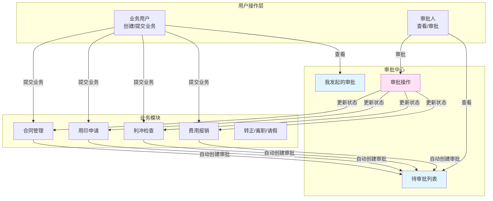
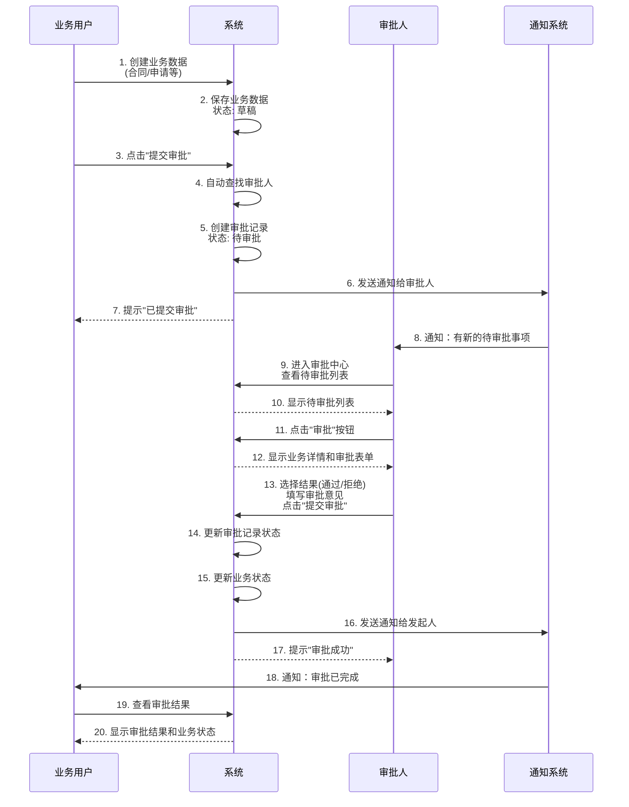
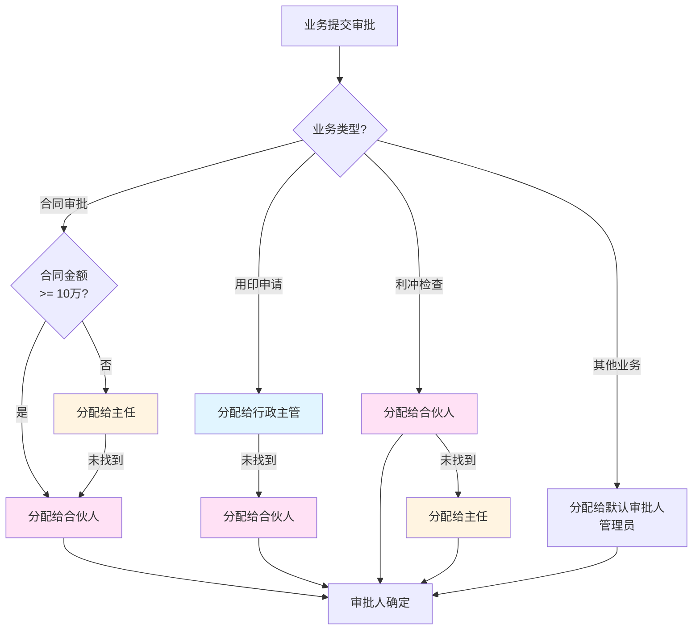
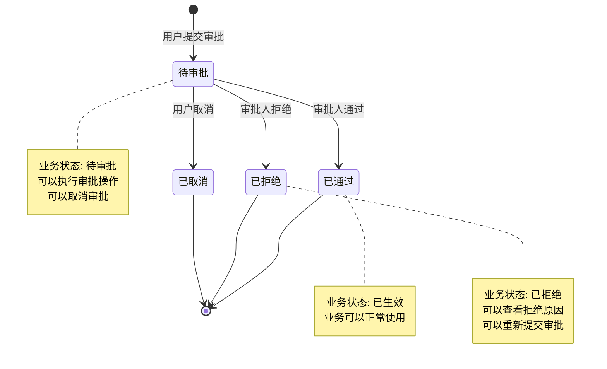

# 审批功能说明文档（产品版）

## 📊 审批系统总览



## 一、功能概览

### 1.1 支持的审批业务类型

系统支持以下业务类型的审批：

| 业务类型 | 说明 | 触发时机 |
|---------|------|---------|
| **合同审批** | 合同创建后需要审批 | 用户点击"提交审批"按钮 |
| **用印申请** | 用印申请需要审批 | 创建用印申请时自动提交 |
| **利冲检查** | 利益冲突检查发现冲突时需要审批 | 系统检测到冲突时自动创建 |
| **费用报销** | 费用报销申请需要审批 | 创建费用报销时自动提交 |
| **转正申请** | 员工转正申请需要审批 | 创建转正申请时自动提交 |
| **离职申请** | 员工离职申请需要审批 | 创建离职申请时自动提交 |
| **请假申请** | 员工请假申请需要审批 | 创建请假申请时自动提交 |

### 1.2 审批状态

- **待审批（PENDING）** - 已提交，等待审批人处理
- **已通过（APPROVED）** - 审批人已通过，业务生效
- **已拒绝（REJECTED）** - 审批人已拒绝，业务不生效
- **已取消（CANCELLED）** - 发起人取消了审批

### 1.3 审批优先级和紧急程度

**优先级**：
- 🔴 **高（HIGH）** - 重要业务，优先处理
- 🟡 **中（MEDIUM）** - 普通业务（默认）
- 🟢 **低（LOW）** - 一般业务

**紧急程度**：
- ⚠️ **紧急（URGENT）** - 需要尽快处理
- 📋 **普通（NORMAL）** - 正常处理（默认）

## 二、前端操作流程

### 2.1 提交审批（业务用户操作）

#### 场景一：合同审批

**操作步骤**：

1. **进入合同管理页面**
   - 路径：财务管理 → 合同管理

2. **创建或编辑合同**
   - 填写合同基本信息（合同名称、金额、客户等）
   - 保存合同（此时状态为"草稿"）

3. **提交审批**
   - 在合同详情页或列表页，点击 **"提交审批"** 按钮
   - 系统自动：
     - 将合同状态更新为"待审批"
     - 根据合同金额自动选择审批人（金额≥10万需要合伙人审批）
     - 创建审批记录
   - 提示："合同已提交审批，等待审批人处理"

4. **查看审批进度**
   - 在合同详情页可以看到审批状态
   - 可以点击"查看审批记录"查看审批详情

#### 场景二：用印申请

**操作步骤**：

1. **进入用印申请页面**
   - 路径：文档管理 → 用印申请

2. **创建用印申请**
   - 填写申请信息（文档名称、用印类型、用途等）
   - 上传需要盖章的文档
   - 点击 **"提交"** 按钮

3. **自动创建审批**
   - 系统自动创建审批记录（无需手动点击"提交审批"）
   - 审批人：行政主管或合伙人
   - 提示："用印申请已提交，等待审批"

#### 场景三：利冲检查

**操作步骤**：

1. **创建项目时触发利冲检查**
   - 路径：项目管理 → 创建项目
   - 系统自动执行利冲检查

2. **如果发现冲突**
   - 系统自动创建审批记录
   - 优先级：高，紧急程度：紧急
   - 审批人：合伙人或主任
   - 项目状态变为"冲突"，需要审批通过后才能继续

3. **如果无冲突**
   - 直接通过，无需审批

#### 场景四：费用报销

**操作步骤**：

1. **进入费用报销页面**
   - 路径：财务管理 → 费用报销

2. **创建费用报销**
   - 填写报销信息（费用类型、金额、日期、说明等）
   - 上传相关凭证
   - 点击 **"提交"** 按钮

3. **自动创建审批**
   - 系统自动创建审批记录
   - 审批人：默认审批人（管理员）

### 2.2 审批操作（审批人操作）

#### 查看待审批列表

**操作步骤**：

1. **进入审批中心**
   - 路径：工作台 → 审批中心
   - 或：顶部导航栏 → 审批中心

2. **查看待审批列表**
   - 默认显示"待我审批"标签页
   - 列表显示：
     - 审批编号
     - 业务类型（合同审批、用印申请等）
     - 业务标题
     - 发起人
     - 提交时间
     - 优先级（高/中/低）
     - 紧急程度（紧急/普通）
     - 操作按钮（审批/查看详情）

3. **筛选和排序**
   - 可按业务类型筛选
   - 可按优先级排序（高优先级在前）
   - 可按紧急程度筛选
   - 可按提交时间排序

4. **查看审批详情**
   - 点击列表中的"查看详情"或业务标题
   - 详情页显示：
     - 审批基本信息（审批编号、状态、发起人、审批人等）
     - 业务详情（完整的业务数据）
     - 审批历史（如果有多次审批）

#### 执行审批操作

**操作步骤**：

1. **在待审批列表中**
   - 找到需要审批的记录
   - 点击 **"审批"** 按钮

2. **进入审批页面**
   - 显示业务详情（可查看完整信息）
   - 审批操作区域：
     - **审批结果**：选择"通过"或"拒绝"
     - **审批意见**：填写审批意见（必填）
     - **提交审批**按钮

3. **填写审批意见并提交**
   - 选择审批结果（通过/拒绝）
   - 填写审批意见（说明通过或拒绝的原因）
   - 点击 **"提交审批"** 按钮

4. **审批完成**
   - 系统提示："审批操作成功"
   - 审批记录状态更新
   - 业务状态自动更新：
     - 通过：业务状态变为"已生效"
     - 拒绝：业务状态变为"已拒绝"
   - 发起人会收到通知

#### 批量审批

**操作步骤**：

1. **在待审批列表中**
   - 勾选多个需要审批的记录（支持多选）
   - 点击 **"批量审批"** 按钮

2. **批量审批操作**
   - 选择审批结果（通过/拒绝）
   - 填写审批意见（可选，会应用到所有选中的记录）
   - 点击 **"提交"** 按钮

3. **批量处理结果**
   - 系统显示处理结果：
     - 成功数量
     - 跳过数量（已处理或无权审批的记录）
     - 错误信息（如果有）

### 2.3 查看我发起的审批（业务用户操作）

**操作步骤**：

1. **进入审批中心**
   - 路径：工作台 → 审批中心

2. **切换到"我发起的"标签页**
   - 显示当前用户发起的所有审批记录

3. **查看审批状态**
   - **待审批**：等待审批人处理
   - **已通过**：审批已通过，业务已生效
   - **已拒绝**：审批被拒绝，可查看拒绝原因
   - **已取消**：已取消的审批

4. **查看审批详情**
   - 点击列表中的记录
   - 查看：
     - 审批进度
     - 审批人信息
     - 审批意见（如果已审批）
     - 审批时间

5. **取消审批（可选）**
   - 对于"待审批"状态的记录
   - 可以点击 **"取消审批"** 按钮
   - 确认后，审批记录状态变为"已取消"
   - 业务状态恢复为提交前的状态

### 2.4 审批流程可视化



## 三、界面功能说明

### 3.1 审批中心主界面

**页面布局**：

```
┌─────────────────────────────────────────────────┐
│  审批中心                                        │
├─────────────────────────────────────────────────┤
│  [待我审批] [我发起的] [全部审批]                │
├─────────────────────────────────────────────────┤
│  筛选: [业务类型 ▼] [优先级 ▼] [状态 ▼]        │
│  排序: [提交时间 ▼] [优先级 ▼]                  │
├─────────────────────────────────────────────────┤
│  审批编号    业务类型    业务标题    发起人      │
│  优先级      紧急程度    提交时间    状态  操作  │
├─────────────────────────────────────────────────┤
│  APP001      合同审批    某某合同    张三        │
│  🔴高        📋普通     2024-01-15  待审批 [审批]│
├─────────────────────────────────────────────────┤
│  APP002      用印申请    合同盖章    李四        │
│  🟡中        📋普通     2024-01-15  待审批 [审批]│
├─────────────────────────────────────────────────┤
│  APP003      利冲检查    客户冲突    王五        │
│  🔴高        ⚠️紧急     2024-01-15  待审批 [审批]│
└─────────────────────────────────────────────────┘
```

**功能说明**：

- **标签页切换**：
  - **待我审批**：显示当前用户需要审批的所有记录
  - **我发起的**：显示当前用户发起的所有审批记录
  - **全部审批**：显示所有审批记录（管理员可见）

- **筛选功能**：
  - 按业务类型筛选（合同、用印申请、利冲检查等）
  - 按优先级筛选（高、中、低）
  - 按状态筛选（待审批、已通过、已拒绝）

- **排序功能**：
  - 按提交时间排序（最新在前）
  - 按优先级排序（高优先级在前）

- **列表显示**：
  - 高优先级和紧急审批用红色标识
  - 支持分页显示
  - 每页显示数量可配置（10/20/50条）

### 3.2 审批操作界面

**页面布局**：

```
┌─────────────────────────────────────────────────┐
│  审批详情                                        │
├─────────────────────────────────────────────────┤
│  审批编号: APP001                                │
│  业务类型: 合同审批                               │
│  业务标题: 某某公司与XX公司服务合同               │
│  发起人: 张三                                    │
│  提交时间: 2024-01-15 10:30                     │
│  优先级: 🔴高                                    │
│  紧急程度: 📋普通                                │
├─────────────────────────────────────────────────┤
│  业务详情                                        │
│  ┌───────────────────────────────────────────┐ │
│  │ 合同名称: 某某公司与XX公司服务合同          │ │
│  │ 合同金额: ¥100,000.00                     │ │
│  │ 客户名称: XX公司                           │ │
│  │ 合同期限: 2024-01-01 至 2024-12-31        │ │
│  │ ... (其他合同信息)                         │ │
│  └───────────────────────────────────────────┘ │
├─────────────────────────────────────────────────┤
│  审批操作                                        │
│  ┌───────────────────────────────────────────┐ │
│  │ 审批结果: ○ 通过  ○ 拒绝                   │ │
│  │                                            │ │
│  │ 审批意见: [___________________________]   │ │
│  │            (必填，说明通过或拒绝的原因)     │ │
│  │                                            │ │
│  │            [取消]  [提交审批]               │ │
│  └───────────────────────────────────────────┘ │
└─────────────────────────────────────────────────┘
```

**功能说明**：

- **业务详情展示**：
  - 显示完整的业务数据
  - 支持查看附件（如果有）
  - 支持查看业务历史记录

- **审批操作**：
  - 必须选择审批结果（通过或拒绝）
  - 必须填写审批意见
  - 审批意见支持多行文本输入
  - 提交后不可修改

### 3.3 我发起的审批界面

**页面布局**：

```
┌─────────────────────────────────────────────────┐
│  我发起的审批                                    │
├─────────────────────────────────────────────────┤
│  筛选: [业务类型 ▼] [状态 ▼]                   │
├─────────────────────────────────────────────────┤
│  审批编号    业务类型    业务标题    审批人      │
│  状态        提交时间    审批时间    操作        │
├─────────────────────────────────────────────────┤
│  APP001      合同审批    某某合同    李主任      │
│  ✅已通过    2024-01-15  2024-01-16  [查看详情] │
├─────────────────────────────────────────────────┤
│  APP002      用印申请    合同盖章    王主管      │
│  ⏳待审批    2024-01-15  -          [取消审批] │
├─────────────────────────────────────────────────┤
│  APP003      费用报销    差旅费      张经理      │
│  ❌已拒绝    2024-01-14  2024-01-15  [查看详情] │
└─────────────────────────────────────────────────┘
```

**功能说明**：

- **状态标识**：
  - ✅ **已通过**：绿色标识
  - ⏳ **待审批**：黄色标识
  - ❌ **已拒绝**：红色标识
  - 🚫 **已取消**：灰色标识

- **操作功能**：
  - **查看详情**：查看审批详情和审批意见
  - **取消审批**：仅"待审批"状态可取消

## 四、审批人分配规则

### 4.1 自动分配规则

系统根据业务类型和业务规则自动分配审批人：



### 4.2 审批人分配说明

| 业务类型 | 分配规则 | 说明 |
|---------|---------|------|
| **合同审批** | 金额≥10万 → 合伙人<br/>金额<10万 → 主任或合伙人 | 大额合同需要更高级别审批 |
| **用印申请** | 行政主管 → 合伙人 | 优先行政主管，无则合伙人 |
| **利冲检查** | 合伙人 → 主任 | 优先合伙人，无则主任 |
| **费用报销** | 默认审批人（管理员） | 统一由管理员审批 |
| **转正/离职/请假** | 默认审批人（管理员） | 人力资源相关审批 |

## 五、审批状态流转

### 5.1 状态流转图



### 5.2 状态说明

- **待审批 → 已通过**：
  - 业务状态自动更新为"已生效"
  - 发起人收到通知
  - 业务可以正常使用

- **待审批 → 已拒绝**：
  - 业务状态自动更新为"已拒绝"
  - 发起人收到通知，可查看拒绝原因
  - 可以修改业务数据后重新提交审批

- **待审批 → 已取消**：
  - 发起人主动取消审批
  - 业务状态恢复为提交前的状态
  - 可以重新提交审批

## 六、通知机制

### 6.1 通知触发时机

1. **审批创建时**：
   - 通知审批人："您有新的待审批事项"
   - 通知内容：业务类型、业务标题、发起人、优先级

2. **审批完成时**：
   - 通知发起人："您的审批已完成"
   - 通知内容：审批结果、审批意见、审批人

### 6.2 通知方式

- **系统通知**：在系统内显示通知消息
- **邮件通知**：发送邮件到用户邮箱（可选）
- **短信通知**：发送短信到用户手机（可选，紧急审批）

## 七、权限说明

### 7.1 用户角色权限

| 角色 | 权限说明 |
|------|---------|
| **业务用户** | 可以创建业务并提交审批<br/>可以查看自己发起的审批<br/>可以取消自己发起的待审批记录 |
| **审批人** | 可以查看分配给自己的待审批列表<br/>可以审批分配给自己的记录<br/>可以查看审批历史 |
| **管理员** | 可以查看所有审批记录<br/>可以查看审批统计<br/>可以配置审批规则 |

### 7.2 审批权限验证

- 只有被分配的审批人才能审批对应的记录
- 不能审批已处理的记录（防止重复审批）
- 不能审批已取消的记录

## 八、常见问题

### 8.1 业务用户常见问题

**Q: 提交审批后可以修改业务数据吗？**
A: 不可以。提交审批后，业务数据被锁定，需要等待审批完成或取消审批后才能修改。

**Q: 审批被拒绝后怎么办？**
A: 可以查看拒绝原因，修改业务数据后重新提交审批。

**Q: 如何查看审批进度？**
A: 在业务详情页可以看到审批状态，或在"我发起的审批"中查看详细进度。

**Q: 可以取消已提交的审批吗？**
A: 可以。在"我发起的审批"中，对于"待审批"状态的记录，可以点击"取消审批"。

### 8.2 审批人常见问题

**Q: 如何知道有新的待审批事项？**
A: 系统会发送通知，审批中心会显示待审批数量，高优先级和紧急审批会有特殊标识。

**Q: 可以批量审批吗？**
A: 可以。在待审批列表中勾选多条记录，点击"批量审批"即可。

**Q: 审批意见必须填写吗？**
A: 是的。审批意见是必填项，用于说明通过或拒绝的原因。

**Q: 审批后可以修改吗？**
A: 不可以。审批提交后不可修改，请仔细确认后再提交。

## 九、功能总结

### 9.1 核心功能

✅ **统一审批中心**：所有审批记录集中管理，便于查看和处理

✅ **自动分配审批人**：根据业务规则自动分配审批人，无需手动指定

✅ **优先级管理**：支持优先级和紧急程度标识，重要审批优先处理

✅ **批量审批**：支持批量审批操作，提高审批效率

✅ **审批历史**：完整记录审批历史，便于追溯和审计

✅ **实时通知**：审批创建和完成时自动通知相关人员

### 9.2 用户体验

- **操作简单**：一键提交审批，一键审批操作
- **信息清晰**：审批状态、进度一目了然
- **及时反馈**：实时通知，及时了解审批进度
- **灵活筛选**：支持多维度筛选和排序

### 9.3 业务价值

- **提高效率**：自动化审批流程，减少人工协调
- **规范管理**：统一的审批流程，确保合规性
- **可追溯性**：完整的审批记录，便于审计
- **灵活扩展**：支持多种业务类型，易于扩展
