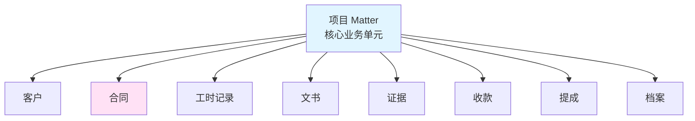
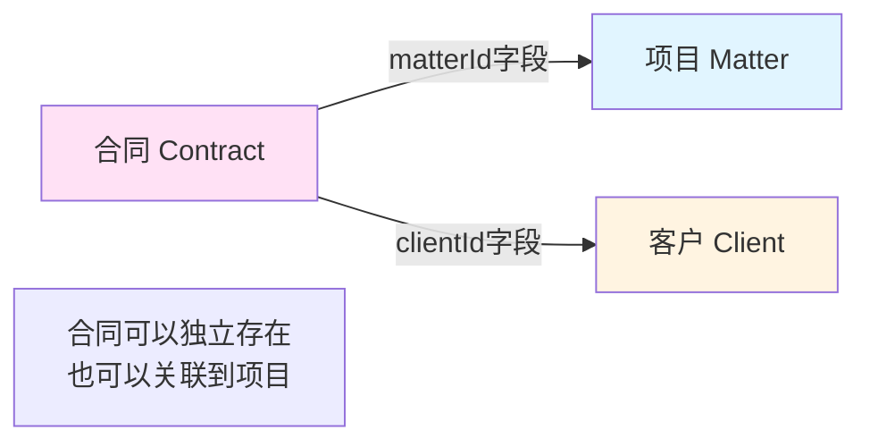
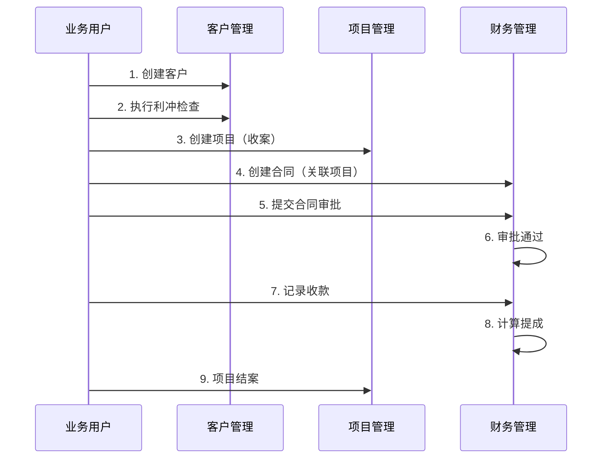

# 项目与合同关系说明（产品版）

## 一、系统核心：项目（Matter）为中心

**是的，系统确实是围绕项目（Matter）进行的。**

项目（Matter）是律所业务的核心单元，所有业务活动都围绕项目展开：



### 1.1 项目在系统中的位置

- **项目是业务主线**：从客户咨询 → 利冲检查 → 项目立项 → 合同签订 → 项目执行 → 收款 → 提成分配 → 结案归档，整个流程都围绕项目进行
- **项目关联所有模块**：客户、合同、工时、文书、证据、收款、提成、档案等都与项目关联
- **项目是数据统计维度**：收入统计、工时统计、提成计算等都以项目为维度

## 二、合同创建位置和导航

### 2.1 前端导航菜单结构

根据系统菜单配置，前端导航结构如下：

```
律所管理系统
├── 🏠 工作台
│   ├── 个人工作台
│   ├── 审批中心
│   └── 统计中心
│
├── 👥 客户管理
│   ├── 客户列表
│   ├── 利冲审查
│   └── 案源管理
│
├── 📋 项目管理 ⭐（核心模块）
│   ├── 项目列表
│   ├── 我的项目
│   ├── 工时管理
│   └── 任务管理
│
├── 💰 财务管理
│   ├── 收费合同 ⭐（合同在这里）
│   ├── 收款管理
│   ├── 提成管理
│   ├── 发票管理
│   └── 财务报表
│
├── 📄 文书管理
│   ├── 文书列表
│   ├── 文书模板
│   ├── 印章管理
│   └── 用印申请
│
├── 🔍 证据管理
│   ├── 证据列表
│   └── 证据入库
│
├── 📦 档案管理
│   ├── 档案列表
│   ├── 档案借阅
│   └── 档案销毁
│
├── 👤 行政后勤
│   ├── 考勤管理
│   ├── 请假管理
│   └── ...
│
├── 🎓 人力资源
│   ├── 员工档案
│   ├── 劳动合同
│   └── ...
│
├── 📚 知识库
│   ├── 法规库
│   ├── 案例库
│   └── ...
│
└── ⚙️ 系统管理
    ├── 用户管理
    ├── 角色管理
    └── ...
```

### 2.2 合同创建入口

**路径**：`财务管理` → `收费合同`

**菜单配置**：
- **菜单名称**：收费合同
- **路径**：`/finance/contract`
- **权限**：`finance:contract:list`
- **图标**：FileProtectOutlined

**操作步骤**：

1. **进入财务管理模块**
   - 点击左侧导航栏的 **"财务管理"** 菜单

2. **进入收费合同页面**
   - 点击 **"收费合同"** 子菜单
   - 或直接访问路径：`/finance/contract`

3. **创建合同**
   - 在合同列表页面右上角，点击 **"新增合同"** 按钮（蓝色主按钮）
   - 弹出合同创建表单
   - 填写合同信息（见下文）

## 三、合同与项目的关联

### 3.1 关联关系

**合同可以关联到项目，但不是必须的。**



### 3.2 关联场景

#### 场景一：从项目创建合同（推荐）

**适用情况**：
- 项目已创建，需要为项目创建合同
- 合同金额、客户等信息可以从项目自动带出

**操作流程**：

```
1. 进入项目管理
   └─> 项目列表 → 选择项目 → 项目详情页

2. 在项目详情页
   └─> 点击"创建合同"按钮（如果有此功能）
   或
   └─> 点击"财务管理"标签 → "创建合同"

3. 创建合同表单
   └─> 项目信息自动带出：
       - 关联项目：已选择（不可修改）
       - 客户：从项目带出
       - 合同金额：可填写或从项目带出
       - 其他信息：手动填写

4. 保存合同
   └─> 合同自动关联到该项目
```

#### 场景二：独立创建合同

**适用情况**：
- 先有合同，后创建项目
- 常年法律顾问合同（可能不关联具体项目）

**操作流程**：

```
1. 进入财务管理 → 收费合同

2. 点击"新建合同"按钮

3. 填写合同信息
   └─> 关联项目：可选择项目（下拉选择）
       或留空（不关联项目）
   └─> 客户：必须选择
   └─> 其他信息：手动填写

4. 保存合同
   └─> 如果选择了项目，合同关联到该项目
   └─> 如果未选择项目，合同独立存在
```

### 3.3 合同创建表单字段

**必填字段**：
- ✅ 合同名称
- ✅ 合同类型（服务合同/常年法顾/诉讼代理/非诉项目）
- ✅ 客户（从下拉列表选择）
- ✅ 收费方式（固定收费/计时收费/风险代理/混合收费）
- ✅ 合同金额

**可选字段**：
- ⭕ 关联项目（从下拉列表选择，可留空）
- ⭕ 签约日期
- ⭕ 生效日期
- ⭕ 到期日期
- ⭕ 签约人（负责律师）
- ⭕ 付款条款
- ⭕ 合同文件（上传）
- ⭕ 备注

### 3.4 关联后的效果

**当合同关联到项目后**：

1. **在项目详情页可以看到合同信息**
   - 显示关联的合同编号、合同名称、合同金额
   - 可以点击查看合同详情

2. **在合同详情页可以看到项目信息**
   - 显示关联的项目编号、项目名称
   - 可以点击跳转到项目详情

3. **收款时可以关联到项目**
   - 收款记录可以同时关联合同和项目
   - 便于财务对账和提成计算

4. **提成计算时使用项目数据**
   - 提成计算以项目为维度
   - 合同金额作为项目收入的一部分

## 四、业务流程建议

### 4.1 标准业务流程



### 4.2 合同创建时机

| 时机 | 说明 | 是否关联项目 |
|------|------|------------|
| **项目创建后** | 项目已立项，需要签订合同 | ✅ 是，推荐 |
| **项目创建前** | 先签合同，后立项 | ⭕ 可选 |
| **常年法顾** | 常年法律顾问合同 | ❌ 通常不关联具体项目 |

### 4.3 最佳实践建议

1. **推荐流程**：
   - 先创建项目（收案）
   - 再创建合同（关联到项目）
   - 这样数据关联清晰，便于后续管理

2. **特殊情况**：
   - 常年法律顾问合同可以不关联项目
   - 可以先有合同，后续再创建项目并关联

3. **数据一致性**：
   - 合同关联项目后，客户信息应该一致
   - 合同金额可以作为项目收入参考

## 五、前端界面说明

### 5.1 合同列表页面

**页面路径**：`/finance/contract`

**页面功能**：
- 合同列表展示（分页）
- 筛选功能（按客户、项目、状态等）
- 搜索功能（按合同编号、合同名称）
- 新建合同按钮
- 合同操作（查看、编辑、删除、提交审批）

**列表字段**：
- 合同编号
- 合同名称
- 客户名称
- 关联项目（如果有）
- 合同金额
- 合同状态
- 签约日期
- 操作按钮

### 5.2 合同创建/编辑表单

**表单布局**：

```
┌─────────────────────────────────────────┐
│  创建合同                                │
├─────────────────────────────────────────┤
│  基本信息                                │
│  ┌───────────────────────────────────┐ │
│  │ 合同名称: [___________________]  │ │
│  │ 合同类型: [下拉选择 ▼]           │ │
│  │ 客户:     [下拉选择 ▼] ⭐必填    │ │
│  │ 关联项目: [下拉选择 ▼] ⭕可选    │ │
│  └───────────────────────────────────┘ │
│                                         │
│  财务信息                                │
│  ┌───────────────────────────────────┐ │
│  │ 收费方式: [下拉选择 ▼] ⭐必填    │ │
│  │ 合同金额: [___________] ⭐必填    │ │
│  │ 币种:     [CNY ▼]                │ │
│  └───────────────────────────────────┘ │
│                                         │
│  时间信息                                │
│  ┌───────────────────────────────────┐ │
│  │ 签约日期: [日期选择器]            │ │
│  │ 生效日期: [日期选择器]            │ │
│  │ 到期日期: [日期选择器]            │ │
│  └───────────────────────────────────┘ │
│                                         │
│  其他信息                                │
│  ┌───────────────────────────────────┐ │
│  │ 签约人:   [下拉选择 ▼]            │ │
│  │ 付款条款: [文本域]                │ │
│  │ 合同文件: [文件上传]              │ │
│  │ 备注:     [文本域]                │ │
│  └───────────────────────────────────┘ │
│                                         │
│            [取消]  [保存]              │
└─────────────────────────────────────────┘
```

**关联项目字段说明**：
- **字段名称**：关联项目
- **字段类型**：下拉选择框
- **数据来源**：当前用户有权限查看的项目列表
- **显示内容**：项目编号 + 项目名称
- **是否必填**：否（可选）
- **默认值**：如果从项目详情页进入，自动选择当前项目

### 5.3 项目详情页中的合同信息

**在项目详情页中**：

```
项目详情页
├── 基本信息
├── 财务管理标签页
│   ├── 关联合同
│   │   ├── 合同列表（如果有）
│   │   │   └─> 合同编号、合同名称、合同金额、状态
│   │   └── [创建合同] 按钮
│   ├── 收款记录
│   └── 提成记录
├── 工时记录
├── 文书管理
└── ...
```

## 六、常见问题

### Q1: 合同必须关联项目吗？

**A**: 不是必须的。合同可以独立存在，也可以关联到项目。但推荐关联项目，这样数据更清晰，便于管理。

### Q2: 一个项目可以有多个合同吗？

**A**: 可以。一个项目可以关联多个合同，比如：
- 主合同（服务合同）
- 补充协议
- 变更协议

### Q3: 合同创建后可以修改关联的项目吗？

**A**: 可以。在合同编辑页面，可以修改"关联项目"字段。但需要注意：
- 只有"草稿"和"待审批"状态的合同可以修改
- 已生效的合同不建议修改关联项目

### Q4: 从项目创建合同有什么优势？

**A**: 
- 客户信息自动带出，减少输入
- 数据关联清晰，便于后续管理
- 在项目详情页可以直接查看合同信息
- 收款和提成计算更准确

### Q5: 合同和项目的关系是什么？

**A**: 
- **项目**是业务执行单元（做什么事）
- **合同**是财务约定单元（收多少钱）
- 一个项目通常对应一个主合同
- 合同金额是项目收入的基础

## 七、总结

1. **系统核心**：项目（Matter）是系统的核心业务单元，所有业务围绕项目展开

2. **合同位置**：合同在 **财务管理** → **收费合同** 菜单下

3. **关联关系**：合同通过 `matterId` 字段关联到项目，但不是必须的

4. **推荐流程**：先创建项目，再创建合同并关联到项目

5. **前端操作**：
   - 路径：`财务管理` → `收费合同`
   - 创建合同时可以选择关联项目（下拉选择）
   - 项目详情页可以查看关联的合同

6. **数据关联**：合同关联项目后，在项目详情页可以看到合同信息，在合同详情页可以看到项目信息

