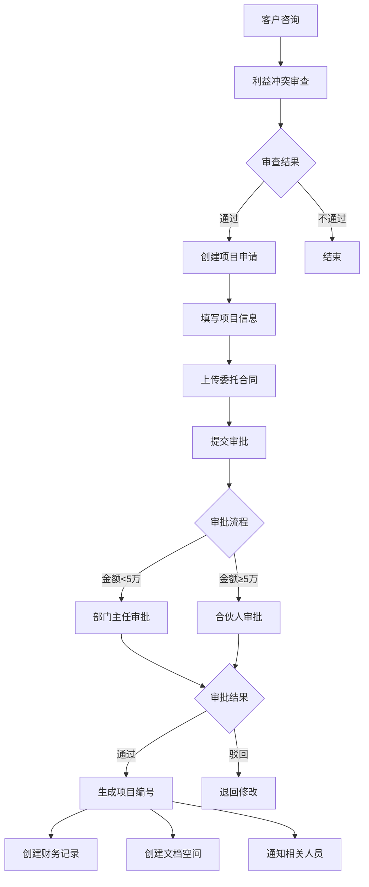

# 🚀 **智慧律所管理系统 - 优化完善版**

基于您的反馈，我将提供**更务实、更经济、更易实施**的完整方案。这个方案将解决原方案的过度设计问题，同时保持完整的业务功能。

## 📋 **优化版核心设计原则**

1. **单体为主，模块清晰**：用 Spring Boot 单体应用替代复杂的微服务
2. **技术栈简化**：移除不必要的中间件，降低运维复杂度
3. **成本控制**：硬件成本从 20万+ 降至 5万内
4. **渐进增强**：按实际需求逐步添加 AI 等高级功能
5. **符合律师习惯**：以线下编辑为主，线上协作为辅

---

## 🏗️ **优化后的系统架构**

### **整体架构图（简化版）**
```
┌─────────────────────────────────────────────┐
│                用户接入层                    │
│  ┌────────────┬────────────┬────────────┐  │
│  │ Web管理端  │ 移动端     │ 客户门户   │  │
│  │ (Vben Admin)│(H5/PWA)   │(查询平台)  │  │
│  └────────────┴────────────┴────────────┘  │
└─────────────────────────────────────────────┘
                        │
┌─────────────────────────────────────────────┐
│               Nginx反向代理                  │
│    ┌──────────────────────────────────┐    │
│    │ SSL终止 │ 静态文件 │ API路由 │    │
│    └──────────────────────────────────┘    │
└─────────────────────────────────────────────┘
                        │
┌─────────────────────────────────────────────┐
│          Spring Boot单体应用                 │
│  ┌──────┬──────┬──────┬──────┬──────┐      │
│  │ 认证 │ 客户 │ 项目 │ 财务 │ 文书 │      │
│  │ 模块 │ 模块 │ 模块 │ 模块 │ 模块 │      │
│  └──────┴──────┴──────┴──────┴──────┘      │
└─────────────────────────────────────────────┘
                        │
┌─────────────────────────────────────────────┐
│               数据存储层                     │
│  ┌──────┬──────┬──────┬──────┬──────┐      │
│  │PostgreSQL│ Redis  │ MinIO │ 备份 │      │
│  │          │        │       │      │      │
│  └──────┴──────┴──────┴──────┴──────┘      │
└─────────────────────────────────────────────┘
```

---

## 💰 **硬件配置方案（务实版）**

### **1. 主流服务器方案（2-3万元）**
```yaml
推荐配置（戴尔T350塔式服务器）:
  - CPU: Intel Xeon E-2314 (4核8线程) 或同级
  - 内存: 32GB ECC DDR4
  - 存储:
    - 系统盘: 512GB NVMe SSD
    - 数据盘: 2 × 2TB SSD (RAID 1)
    - 备份盘: 4TB HDD (外接或NAS)
  - 网卡: 千兆网卡
  - 预估成本: ¥18,000-25,000

备选配置（组装服务器）:
  - CPU: AMD Ryzen 7 5700X (8核16线程)
  - 内存: 64GB DDR4
  - 存储: 同上述配置
  - 预估成本: ¥12,000-15,000
```

### **2. 虚拟化/容器化方案**
```bash
# 使用 Proxmox VE 或 ESXi 免费版
# 虚拟机分配方案：
VM1: 数据库服务器 (4核8G, 500G)
VM2: 应用服务器 (4核8G, 200G)
VM3: 文件服务器 (2核4G, 2T)
VM4: 测试环境 (4核8G, 200G)

# 或直接 Docker 部署在一台机器上
```

### **3. 备份方案（关键！）**
```yaml
备份策略:
  1. 本地备份:
    - 每日增量备份到外置硬盘
    - 每周全量备份
  
  2. 异地备份:
    - 使用 Synology NAS 或 QNAP NAS
    - 配置 rsync 自动同步
    - 或使用阿里云/腾讯云对象存储
  
  3. 重要数据双备份:
    - 客户资料、合同、财务数据双重备份
    - 备份保留周期: 永久保留
  
预算:
  - NAS设备: ¥3,000-5,000
  - 备份硬盘: ¥1,000-2,000/年
```

---

## 🐳 **简化版 Docker Compose 编排**

### **完整的 docker-compose.yml**
```yaml
version: '3.8'

services:
  # 1. PostgreSQL 数据库（主）
  postgres:
    image: postgres:15-alpine
    container_name: law-postgres
    restart: always
    environment:
      POSTGRES_DB: law_firm
      POSTGRES_USER: law_admin
      POSTGRES_PASSWORD: ${DB_PASSWORD}
      POSTGRES_INITDB_ARGS: "--encoding=UTF8 --locale=zh_CN.UTF-8"
      PGDATA: /var/lib/postgresql/data/pgdata
    volumes:
      - postgres_data:/var/lib/postgresql/data
      - ./init-db:/docker-entrypoint-initdb.d
    ports:
      - "5432:5432"
    networks:
      - law-network
    healthcheck:
      test: ["CMD-SHELL", "pg_isready -U law_admin"]
      interval: 30s
      timeout: 10s
      retries: 5
    command: >
      postgres -c max_connections=200
               -c shared_buffers=256MB
               -c effective_cache_size=1GB
               -c maintenance_work_mem=64MB
               -c checkpoint_completion_target=0.9
               -c wal_buffers=16MB
               -c default_statistics_target=100

  # 2. Redis 缓存
  redis:
    image: redis:7-alpine
    container_name: law-redis
    restart: always
    command: redis-server --requirepass ${REDIS_PASSWORD} --appendonly yes --maxmemory 512mb --maxmemory-policy allkeys-lru
    volumes:
      - redis_data:/data
    ports:
      - "6379:6379"
    networks:
      - law-network
    healthcheck:
      test: ["CMD", "redis-cli", "--raw", "incr", "ping"]
      interval: 30s
      timeout: 10s
      retries: 5

  # 3. MinIO 对象存储
  minio:
    image: minio/minio:RELEASE.2024-01-18T22-51-09Z
    container_name: law-minio
    restart: always
    command: server /data --console-address ":9001"
    environment:
      MINIO_ROOT_USER: ${MINIO_ROOT_USER}
      MINIO_ROOT_PASSWORD: ${MINIO_ROOT_PASSWORD}
      MINIO_DOMAIN: lawfirm.local
    volumes:
      - minio_data:/data
      - ./minio/config:/root/.minio
    ports:
      - "9000:9000"
      - "9001:9001"
    networks:
      - law-network
    healthcheck:
      test: ["CMD", "curl", "-f", "http://localhost:9000/minio/health/live"]
      interval: 30s
      timeout: 20s
      retries: 3

  # 4. 全文搜索引擎（按需启用）
  elasticsearch:
    image: elasticsearch:8.11.0
    container_name: law-elasticsearch
    restart: unless-stopped
    environment:
      - discovery.type=single-node
      - xpack.security.enabled=false
      - "ES_JAVA_OPTS=-Xms512m -Xmx512m"
      - cluster.name=law-firm-cluster
    volumes:
      - elasticsearch_data:/usr/share/elasticsearch/data
    ports:
      - "9200:9200"
    networks:
      - law-network
    ulimits:
      memlock:
        soft: -1
        hard: -1
      nofile:
        soft: 65536
        hard: 65536
    healthcheck:
      test: ["CMD", "curl", "-f", "http://localhost:9200/_cluster/health"]
      interval: 30s
      timeout: 10s
      retries: 5

  # 5. 后端 Spring Boot 应用
  backend:
    build:
      context: ./backend
      dockerfile: Dockerfile
    container_name: law-backend
    restart: always
    environment:
      SPRING_PROFILES_ACTIVE: prod
      TZ: Asia/Shanghai
      # 数据库配置
      DB_HOST: postgres
      DB_PORT: 5432
      DB_NAME: law_firm
      DB_USERNAME: law_admin
      DB_PASSWORD: ${DB_PASSWORD}
      # Redis配置
      REDIS_HOST: redis
      REDIS_PORT: 6379
      REDIS_PASSWORD: ${REDIS_PASSWORD}
      # MinIO配置
      MINIO_ENDPOINT: http://minio:9000
      MINIO_ACCESS_KEY: ${MINIO_ROOT_USER}
      MINIO_SECRET_KEY: ${MINIO_ROOT_PASSWORD}
      MINIO_BUCKET: law-documents
      # JWT配置
      JWT_SECRET: ${JWT_SECRET}
      JWT_EXPIRATION: 86400000
      # 应用配置
      SERVER_PORT: 8080
      UPLOAD_MAX_SIZE: 50MB
      CORS_ALLOWED_ORIGINS: http://localhost,http://lawfirm.local
    ports:
      - "8080:8080"
    volumes:
      - backend_logs:/app/logs
      - backend_uploads:/app/uploads
      - /etc/localtime:/etc/localtime:ro
    networks:
      - law-network
    depends_on:
      postgres:
        condition: service_healthy
      redis:
        condition: service_healthy
      minio:
        condition: service_healthy
    healthcheck:
      test: ["CMD", "curl", "-f", "http://localhost:8080/actuator/health"]
      interval: 30s
      timeout: 10s
      retries: 3

  # 6. 前端 Nginx
  frontend:
    build:
      context: ./frontend
      dockerfile: Dockerfile
    container_name: law-frontend
    restart: always
    ports:
      - "80:80"
      - "443:443"
    volumes:
      - ./nginx/nginx.conf:/etc/nginx/nginx.conf
      - ./nginx/ssl:/etc/nginx/ssl
      - frontend_logs:/var/log/nginx
      - frontend_static:/usr/share/nginx/html
    networks:
      - law-network
    depends_on:
      - backend
    healthcheck:
      test: ["CMD", "curl", "-f", "http://localhost/health"]
      interval: 30s
      timeout: 10s
      retries: 3

  # 7. OCR服务（按需启用）
  paddle-ocr:
    image: paddlepaddle/paddle:2.5.1-cpu
    container_name: law-paddle-ocr
    restart: on-failure
    volumes:
      - ./ocr-service:/app
      - ocr_models:/app/models
      - ocr_cache:/app/cache
    ports:
      - "8001:8000"
    networks:
      - law-network
    environment:
      OCR_MODEL_DIR: /app/models
      OCR_LANG: "ch"
      OCR_USE_GPU: "false"
      OCR_MAX_WORKERS: "2"
    entrypoint: >
      sh -c "
      if [ ! -f /app/models/det.onnx ]; then
        echo 'Downloading OCR models...'
        wget -P /app/models https://paddleocr.bj.bcebos.com/PP-OCRv4/chinese/ch_PP-OCRv4_det_infer.tar &&
        tar -xf /app/models/ch_PP-OCRv4_det_infer.tar -C /app/models &&
        wget -P /app/models https://paddleocr.bj.bcebos.com/PP-OCRv4/chinese/ch_PP-OCRv4_rec_infer.tar &&
        tar -xf /app/models/ch_PP-OCRv4_rec_infer.tar -C /app/models
      fi &&
      cd /app && python main.py
      "
    healthcheck:
      test: ["CMD", "curl", "-f", "http://localhost:8000/health"]
      interval: 30s
      timeout: 10s
      retries: 3

  # 8. OnlyOffice文档服务（按需启用）
  onlyoffice:
    image: onlyoffice/documentserver:7.5
    container_name: law-onlyoffice
    restart: on-failure
    environment:
      JWT_ENABLED: "true"
      JWT_SECRET: ${ONLYOFFICE_JWT_SECRET}
      JWT_HEADER: "AuthorizationJwt"
      DB_TYPE: "postgres"
      DB_HOST: "postgres"
      DB_PORT: "5432"
      DB_NAME: "onlyoffice"
      DB_USER: "onlyoffice_user"
      DB_PWD: ${ONLYOFFICE_DB_PASSWORD}
    volumes:
      - onlyoffice_data:/var/www/onlyoffice/Data
      - onlyoffice_logs:/var/log/onlyoffice
    ports:
      - "8081:80"
    networks:
      - law-network
    depends_on:
      - postgres
    healthcheck:
      test: ["CMD", "curl", "-f", "http://localhost/healthcheck"]
      interval: 30s
      timeout: 10s
      retries: 3

  # 9. 监控面板（可选）
  portainer:
    image: portainer/portainer-ce:latest
    container_name: law-portainer
    restart: unless-stopped
    command: -H unix:///var/run/docker.sock
    ports:
      - "9002:9000"
    volumes:
      - /var/run/docker.sock:/var/run/docker.sock
      - portainer_data:/data
    networks:
      - law-network

volumes:
  postgres_data:
  redis_data:
  minio_data:
  elasticsearch_data:
  onlyoffice_data:
  ocr_models:
  ocr_cache:
  backend_logs:
  backend_uploads:
  frontend_logs:
  frontend_static:
  portainer_data:

networks:
  law-network:
    driver: bridge
    ipam:
      config:
        - subnet: 172.20.0.0/16
```

### **环境变量配置文件 (.env)**
```bash
# 数据库配置
DB_PASSWORD=LawFirm2024!Secure

# Redis配置
REDIS_PASSWORD=Redis2024!Secure

# MinIO配置
MINIO_ROOT_USER=admin
MINIO_ROOT_PASSWORD=Minio2024!Secure

# JWT配置
JWT_SECRET=jwt-secret-key-2024-law-firm-system

# OnlyOffice配置
ONLYOFFICE_JWT_SECRET=onlyoffice-jwt-2024
ONLYOFFICE_DB_PASSWORD=onlyoffice-db-2024
```

### **Nginx 配置文件**
```nginx
# nginx/nginx.conf
user nginx;
worker_processes auto;
error_log /var/log/nginx/error.log warn;
pid /var/run/nginx.pid;

events {
    worker_connections 1024;
}

http {
    include /etc/nginx/mime.types;
    default_type application/octet-stream;

    log_format main '$remote_addr - $remote_user [$time_local] "$request" '
                    '$status $body_bytes_sent "$http_referer" '
                    '"$http_user_agent" "$http_x_forwarded_for"';

    access_log /var/log/nginx/access.log main;

    sendfile on;
    tcp_nopush on;
    tcp_nodelay on;
    keepalive_timeout 65;
    types_hash_max_size 2048;
    client_max_body_size 100M;

    # 开启gzip
    gzip on;
    gzip_vary on;
    gzip_min_length 1024;
    gzip_types text/plain text/css text/xml text/javascript 
               application/javascript application/xml+rss 
               application/json;

    # SSL配置（自签名证书示例）
    ssl_protocols TLSv1.2 TLSv1.3;
    ssl_ciphers ECDHE-RSA-AES256-GCM-SHA512:DHE-RSA-AES256-GCM-SHA512;
    ssl_prefer_server_ciphers off;
    ssl_session_cache shared:SSL:10m;
    ssl_session_timeout 10m;

    upstream backend {
        server backend:8080;
    }

    upstream onlyoffice {
        server onlyoffice:80;
    }

    upstream paddle_ocr {
        server paddle-ocr:8000;
    }

    # 主服务器
    server {
        listen 80;
        server_name lawfirm.local;
        
        # 重定向到HTTPS
        location / {
            return 301 https://$server_name$request_uri;
        }
    }

    server {
        listen 443 ssl http2;
        server_name lawfirm.local;

        # SSL证书（生产环境请替换为正式证书）
        ssl_certificate /etc/nginx/ssl/lawfirm.crt;
        ssl_certificate_key /etc/nginx/ssl/lawfirm.key;

        # 安全头
        add_header X-Frame-Options SAMEORIGIN;
        add_header X-Content-Type-Options nosniff;
        add_header X-XSS-Protection "1; mode=block";

        # 前端静态资源
        location / {
            root /usr/share/nginx/html;
            index index.html index.htm;
            try_files $uri $uri/ /index.html;
            
            # 静态资源缓存
            location ~* \.(js|css|png|jpg|jpeg|gif|ico|svg)$ {
                expires 1y;
                add_header Cache-Control "public, immutable";
            }
        }

        # API代理
        location /api/ {
            proxy_pass http://backend;
            proxy_http_version 1.1;
            proxy_set_header Upgrade $http_upgrade;
            proxy_set_header Connection 'upgrade';
            proxy_set_header Host $host;
            proxy_set_header X-Real-IP $remote_addr;
            proxy_set_header X-Forwarded-For $proxy_add_x_forwarded_for;
            proxy_set_header X-Forwarded-Proto $scheme;
            
            proxy_connect_timeout 300s;
            proxy_send_timeout 300s;
            proxy_read_timeout 300s;
        }

        # WebSocket支持
        location /ws/ {
            proxy_pass http://backend;
            proxy_http_version 1.1;
            proxy_set_header Upgrade $http_upgrade;
            proxy_set_header Connection "Upgrade";
            proxy_set_header Host $host;
            
            proxy_read_timeout 86400s;
        }

        # OnlyOffice代理
        location /office/ {
            proxy_pass http://onlyoffice/;
            proxy_http_version 1.1;
            proxy_set_header Host $host;
            proxy_set_header X-Forwarded-Proto $scheme;
            
            client_max_body_size 500M;
            proxy_connect_timeout 600s;
            proxy_send_timeout 600s;
            proxy_read_timeout 600s;
        }

        # OCR代理
        location /ocr/ {
            proxy_pass http://paddle_ocr/;
            proxy_http_version 1.1;
            proxy_set_header Host $host;
            
            client_max_body_size 50M;
            proxy_connect_timeout 300s;
            proxy_send_timeout 300s;
            proxy_read_timeout 300s;
        }

        # MinIO文件访问
        location /files/ {
            proxy_pass http://minio:9000/;
            proxy_http_version 1.1;
            proxy_set_header Host $host;
            proxy_set_header X-Real-IP $remote_addr;
            
            # 下载缓存
            proxy_cache my_cache;
            proxy_cache_key "$scheme$request_method$host$request_uri";
            proxy_cache_valid 200 302 10m;
            proxy_cache_valid 404 1m;
            
            client_max_body_size 500M;
        }

        # 健康检查
        location /health {
            access_log off;
            return 200 "healthy\n";
            add_header Content-Type text/plain;
        }
    }
}
```

---

## 🎯 **开发实施详细计划**

### **第一阶段：基础框架搭建（3-4周）**

#### **第1周：项目初始化**
```bash
# 后端项目结构
backend/
├── src/main/java/com/lawfirm/
│   ├── LawFirmApplication.java          # 启动类
│   ├── config/                          # 配置类
│   │   ├── SecurityConfig.java          # 安全配置
│   │   ├── DatabaseConfig.java          # 数据库配置
│   │   ├── RedisConfig.java             # Redis配置
│   │   ├── MinioConfig.java             # MinIO配置
│   │   └── WebConfig.java               # Web配置
│   ├── common/                          # 公共模块
│   │   ├── exception/                   # 异常处理
│   │   ├── utils/                       # 工具类
│   │   ├── constants/                   # 常量定义
│   │   ├── annotation/                  # 自定义注解
│   │   └── interceptor/                 # 拦截器
│   └── modules/                         # 业务模块
│       ├── auth/                        # 认证授权
│       ├── client/                      # 客户管理
│       ├── project/                     # 项目管理
│       ├── finance/                     # 财务管理
│       ├── document/                    # 文书管理
│       ├── admin/                       # 行政办公
│       ├── workflow/                    # 工作流
│       └── knowledge/                   # 知识库
└── src/main/resources/
    ├── application.yml                  # 主配置文件
    ├── application-prod.yml             # 生产环境配置
    └── mapper/                          # MyBatis映射文件

# 前端项目结构
frontend/
├── src/
│   ├── api/                            # API接口
│   ├── views/                          # 页面视图
│   ├── components/                     # 组件库
│   ├── utils/                          # 工具函数
│   └── main.ts                         # 入口文件
├── public/
└── package.json
```

#### **第2周：核心功能开发**
1. **用户认证与权限系统**
   - 基于JWT的登录认证
   - 角色权限控制（RBAC）
   - 菜单权限动态加载

2. **客户管理模块**
   - 客户信息CRUD
   - 客户分类与标签
   - 客户联系人管理

3. **基础项目管理**
   - 项目创建与基本信息维护
   - 项目状态流转

#### **第3周：财务与文档基础**
1. **财务管理基础**
   - 合同收费登记
   - 付款计划管理
   - 基础到账登记

2. **文档管理基础**
   - 文件上传下载
   - 文档分类管理
   - 基础版本控制

#### **第4周：集成测试与部署**
1. **前后端联调**
2. **基础功能测试**
3. **Docker容器化部署**
4. **用户培训与试用**

---

### **第二阶段：核心业务完善（4-6周）**

#### **第5-6周：核心流程实现**
1. **利益冲突审查流程**
   - 自动检索匹配
   - 审查单生成
   - 审查结果审批

2. **收案审批流程**
   - 多级审批设计
   - 审批意见记录
   - 审批状态跟踪

3. **用印申请流程**
   - 用印申请单
   - 用印审批流程
   - 用印记录管理

#### **第7-8周：财务深度开发**
1. **提成计算系统**
   - 提成规则配置
   - 自动提成计算
   - 提成审批发放

2. **财务报表**
   - 营收统计报表
   - 律师业绩报表
   - 客户贡献分析

#### **第9-10周：高级功能集成**
1. **OCR智能识别**
   - 银行回单识别
   - 合同关键信息提取
   - 智能匹配项目

2. **工作流引擎集成**
   - Flowable流程设计
   - 自定义审批流程
   - 流程监控与分析

---

### **第三阶段：优化与扩展（3-4周）**

#### **第11-12周：系统优化**
1. **性能优化**
   - 数据库索引优化
   - 缓存策略优化
   - 前端性能优化

2. **用户体验优化**
   - 界面交互优化
   - 移动端适配
   - 操作流程简化

#### **第13-14周：扩展功能**
1. **知识库系统**
   - 法律知识库
   - 案例分享
   - 内部文库

2. **统计分析**
   - 业务数据分析
   - 客户画像分析
   - 市场趋势分析

3. **系统集成**
   - 邮件通知集成
   - 短信通知集成
   - 第三方系统对接

---

## 📊 **核心业务模块详细设计**

### **1. 收案管理模块优化设计**

#### **业务流程优化**


#### **数据库表设计优化**
```sql
-- 核心表：项目表
CREATE TABLE project (
    id BIGSERIAL PRIMARY KEY,
    project_no VARCHAR(50) NOT NULL UNIQUE,  -- 项目编号：LF-2024-001
    contract_no VARCHAR(100) NOT NULL,       -- 合同编号
    project_name VARCHAR(200) NOT NULL,      -- 项目名称
    client_id BIGINT NOT NULL,               -- 客户ID
    business_type VARCHAR(50) NOT NULL,      -- 业务类型
    status VARCHAR(20) DEFAULT 'DRAFT',      -- 项目状态
    
    -- 时间信息
    apply_date DATE NOT NULL,                -- 申请日期
    approval_date DATE,                      -- 批准日期
    start_date DATE,                         -- 开始日期
    end_date DATE,                           -- 结案日期
    
    -- 参与人员
    main_lawyer_id BIGINT NOT NULL,          -- 主办律师
    assistant_lawyers JSONB,                 -- 协办律师
    
    -- 财务信息
    contract_amount DECIMAL(15,2),           -- 合同金额
    payment_method VARCHAR(20),              -- 收费方式
    payment_schedule JSONB,                  -- 付款计划
    
    -- 附件信息
    contract_file_url VARCHAR(500),          -- 合同文件
    other_files JSONB,                       -- 其他附件
    
    -- 审计信息
    created_by BIGINT,
    created_at TIMESTAMP DEFAULT CURRENT_TIMESTAMP,
    updated_by BIGINT,
    updated_at TIMESTAMP DEFAULT CURRENT_TIMESTAMP,
    deleted BOOLEAN DEFAULT FALSE
);

-- 创建索引
CREATE INDEX idx_project_client_id ON project(client_id);
CREATE INDEX idx_project_status ON project(status);
CREATE INDEX idx_project_main_lawyer ON project(main_lawyer_id);
CREATE INDEX idx_project_no ON project(project_no);
```

### **2. 财务管理模块详细设计**

#### **提成计算规则配置**
```json
{
  "rule_id": "RULE-001",
  "rule_name": "诉讼业务基础提成规则",
  "rule_type": "BUSINESS_TYPE",
  "business_type": "LITIGATION",
  "effective_date": "2024-01-01",
  "expiration_date": "2024-12-31",
  
  "calculation_formula": "commission = net_amount * commission_rate",
  
  "parameters": {
    "management_fee_rate": 0.10,        // 管理费率 10%
    "tax_rate": 0.056,                  // 综合税率 5.6%
    "commission_rates": [
      {
        "min_amount": 0,
        "max_amount": 100000,
        "rate": 0.30                    // 10万以下提成30%
      },
      {
        "min_amount": 100000,
        "max_amount": 500000,
        "rate": 0.35                    // 10-50万部分提成35%
      },
      {
        "min_amount": 500000,
        "max_amount": 1000000,
        "rate": 0.40                    // 50-100万部分提成40%
      },
      {
        "min_amount": 1000000,
        "max_amount": null,
        "rate": 0.45                    // 100万以上部分提成45%
      }
    ]
  },
  
  "distribution_rules": {
    "main_lawyer_min_ratio": 0.30,      // 主办律师最低比例30%
    "case_source_lawyer_ratio": 0.15,   // 案源律师比例15%
    "assistant_lawyer_max_ratio": 0.20  // 协办律师最高比例20%
  }
}
```

#### **智能核销流程**
```java
@Service
public class SmartReconciliationService {
    
    @Autowired
    private OcrService ocrService;
    
    @Autowired
    private ProjectRepository projectRepository;
    
    @Autowired
    private PaymentRecordRepository paymentRecordRepository;
    
    /**
     * 智能核销银行回单
     */
    @Transactional
    public ReconciliationResult reconcileBankStatement(MultipartFile file) {
        try {
            // 1. OCR识别
            OcrResult ocrResult = ocrService.recognizeBankStatement(file);
            
            // 2. 提取关键信息
            BankStatementInfo statement = extractBankStatementInfo(ocrResult);
            
            // 3. 智能匹配
            List<MatchCandidate> candidates = findMatchingProjects(statement);
            
            // 4. 处理匹配结果
            if (!candidates.isEmpty()) {
                MatchCandidate bestMatch = selectBestMatch(candidates);
                
                if (bestMatch.getMatchScore() > 0.7) {
                    // 自动核销
                    return autoReconcile(statement, bestMatch);
                } else {
                    // 提供候选列表供选择
                    return createCandidateList(statement, candidates);
                }
            } else {
                // 无匹配，创建待处理记录
                return createPendingRecord(statement);
            }
            
        } catch (Exception e) {
            log.error("智能核销失败", e);
            throw new BusinessException("核销处理失败: " + e.getMessage());
        }
    }
    
    /**
     * 智能匹配算法
     */
    private List<MatchCandidate> findMatchingProjects(BankStatementInfo statement) {
        List<Project> pendingProjects = projectRepository.findPendingPaymentProjects();
        
        return pendingProjects.stream()
            .map(project -> {
                double score = calculateMatchScore(statement, project);
                return MatchCandidate.builder()
                    .project(project)
                    .matchScore(score)
                    .reasons(generateMatchReasons(statement, project))
                    .build();
            })
            .filter(candidate -> candidate.getMatchScore() > 0.3)
            .sorted(Comparator.comparing(MatchCandidate::getMatchScore).reversed())
            .limit(5)
            .collect(Collectors.toList());
    }
    
    /**
     * 计算匹配分数
     */
    private double calculateMatchScore(BankStatementInfo statement, Project project) {
        double score = 0.0;
        
        // 1. 金额匹配（权重40%）
        if (statement.getAmount() != null && project.getContractAmount() != null) {
            if (Math.abs(statement.getAmount() - project.getContractAmount()) < 0.01) {
                score += 0.4; // 金额完全匹配
            } else if (statement.getAmount() <= project.getContractAmount()) {
                score += 0.3 * (statement.getAmount() / project.getContractAmount());
            }
        }
        
        // 2. 付款方名称匹配（权重30%）
        if (statement.getPayer() != null && project.getClientName() != null) {
            double similarity = calculateNameSimilarity(statement.getPayer(), project.getClientName());
            score += similarity * 0.3;
        }
        
        // 3. 备注信息匹配（权重20%）
        if (statement.getRemark() != null) {
            if (statement.getRemark().contains(project.getProjectNo()) ||
                statement.getRemark().contains(project.getContractNo())) {
                score += 0.2;
            }
        }
        
        // 4. 时间合理性（权重10%）
        if (statement.getDate() != null && project.getApplyDate() != null) {
            long daysBetween = ChronoUnit.DAYS.between(project.getApplyDate(), statement.getDate());
            if (daysBetween >= 0 && daysBetween <= 60) {
                score += 0.1;
            }
        }
        
        return score;
    }
}
```

---

## 🔧 **技术实现关键点**

### **1. 前端架构优化**

#### **Vben Admin 配置优化**
```typescript
// vite.config.ts - 优化配置
export default defineConfig({
  plugins: [
    vue(),
    vueJsx(),
    Components({
      resolvers: [AntDesignVueResolver()],
    }),
  ],
  resolve: {
    alias: {
      '@': resolve(__dirname, 'src'),
    },
  },
  server: {
    host: '0.0.0.0',
    port: 3000,
    proxy: {
      '/api': {
        target: 'http://localhost:8080',
        changeOrigin: true,
        rewrite: (path) => path.replace(/^\/api/, ''),
      },
      '/files': {
        target: 'http://localhost:9000',
        changeOrigin: true,
      },
    },
  },
  build: {
    target: 'es2015',
    outDir: 'dist',
    assetsDir: 'static',
    rollupOptions: {
      output: {
        manualChunks: {
          vue: ['vue', 'vue-router', 'pinia'],
          antd: ['ant-design-vue'],
          vben: ['@vben/components', '@vben/layouts'],
        },
      },
    },
    chunkSizeWarningLimit: 2000,
  },
});
```

#### **权限控制实现**
```typescript
// src/hooks/web/usePermission.ts
export function usePermission() {
  const userStore = useUserStore()
  
  /**
   * 检查是否有权限
   */
  function hasPermission(permission: string) {
    const { roleList = [] } = userStore.getUserInfo || {}
    
    // 超级管理员拥有所有权限
    if (roleList.includes('super_admin')) {
      return true
    }
    
    // 检查角色权限
    const permissionList = userStore.getPermissionList || []
    return permissionList.includes(permission)
  }
  
  /**
   * 检查是否有数据权限
   */
  function hasDataPermission(projectId: string, permissionType: string) {
    const userInfo = userStore.getUserInfo
    if (!userInfo) return false
    
    // 1. 超级管理员可以查看所有
    if (userInfo.roleList?.includes('super_admin')) {
      return true
    }
    
    // 2. 数据所有者可以查看
    if (userInfo.id === projectId) {
      return true
    }
    
    // 3. 根据权限矩阵判断
    const dataPermissions = userInfo.dataPermissions || {}
    const projectPermissions = dataPermissions[projectId] || []
    
    return projectPermissions.includes(permissionType)
  }
  
  return {
    hasPermission,
    hasDataPermission
  }
}
```

### **2. 后端架构优化**

#### **模块化单体应用结构**
```java
// LawFirmApplication.java - 主启动类
@SpringBootApplication
@EnableCaching
@EnableAsync
@EnableScheduling
@EnableTransactionManagement
@MapperScan("com.lawfirm.modules.*.mapper")
public class LawFirmApplication {
    public static void main(String[] args) {
        SpringApplication.run(LawFirmApplication.class, args);
    }
}

// 配置文件结构
src/main/resources/
├── application.yml                    # 主配置
├── application-dev.yml                # 开发环境
├── application-prod.yml               # 生产环境
├── mapper/                            # MyBatis映射文件
│   ├── auth/
│   ├── client/
│   ├── project/
│   ├── finance/
│   └── document/
└── templates/                         # 模板文件
    ├── email/
    ├── document/
    └── report/
```

#### **统一的响应格式**
```java
@Data
@Builder
@AllArgsConstructor
@NoArgsConstructor
public class ApiResponse<T> {
    private Boolean success;
    private String code;
    private String message;
    private T data;
    private Long timestamp;
    
    public static <T> ApiResponse<T> success(T data) {
        return ApiResponse.<T>builder()
                .success(true)
                .code("200")
                .message("操作成功")
                .data(data)
                .timestamp(System.currentTimeMillis())
                .build();
    }
    
    public static ApiResponse<?> error(String code, String message) {
        return ApiResponse.builder()
                .success(false)
                .code(code)
                .message(message)
                .timestamp(System.currentTimeMillis())
                .build();
    }
}

// 全局异常处理
@RestControllerAdvice
@Slf4j
public class GlobalExceptionHandler {
    
    @ExceptionHandler(BusinessException.class)
    public ApiResponse<?> handleBusinessException(BusinessException e) {
        log.error("业务异常: {}", e.getMessage(), e);
        return ApiResponse.error(e.getCode(), e.getMessage());
    }
    
    @ExceptionHandler(AuthenticationException.class)
    public ApiResponse<?> handleAuthenticationException(AuthenticationException e) {
        return ApiResponse.error("401", "认证失败: " + e.getMessage());
    }
    
    @ExceptionHandler(Exception.class)
    public ApiResponse<?> handleException(Exception e) {
        log.error("系统异常", e);
        return ApiResponse.error("500", "系统异常，请联系管理员");
    }
}
```

---

## 📋 **实施检查清单**

### **第一阶段检查清单（1-4周）**
- [ ] 项目框架搭建完成
- [ ] 数据库设计完成并初始化
- [ ] 用户认证系统开发完成
- [ ] 基础权限系统开发完成
- [ ] 客户管理模块开发完成
- [ ] 基础项目管理开发完成
- [ ] 前后端联调通过
- [ ] Docker容器化部署完成
- [ ] 基础测试通过
- [ ] 用户手册初稿完成

### **第二阶段检查清单（5-10周）**
- [ ] 利益冲突审查流程开发完成
- [ ] 收案审批流程开发完成
- [ ] 用印管理流程开发完成
- [ ] 财务管理基础功能完成
- [ ] 提成计算系统开发完成
- [ ] 财务报表功能开发完成
- [ ] OCR集成完成
- [ ] 工作流引擎集成完成
- [ ] 系统性能测试通过
- [ ] 用户培训材料完成

### **第三阶段检查清单（11-14周）**
- [ ] 系统性能优化完成
- [ ] 移动端适配完成
- [ ] 知识库系统开发完成
- [ ] 统计分析功能开发完成
- [ ] 系统监控告警配置完成
- [ ] 数据备份策略实施
- [ ] 安全加固完成
- [ ] 用户验收测试通过
- [ ] 上线部署完成
- [ ] 运维手册完成

---

## 📈 **成本与收益分析**

### **投资成本估算**

| 项目 | 费用 | 说明 |
|------|------|------|
| 硬件设备 | ¥15,000-25,000 | 服务器 + 网络设备 |
| 软件开发 | ¥150,000-200,000 | 按5人团队开发14周估算 |
| 系统部署 | ¥5,000-10,000 | 部署与配置 |
| 培训费用 | ¥5,000-10,000 | 用户培训 |
| **合计** | **¥175,000-245,000** | 一次性投入 |

### **预期收益**

| 收益类型 | 估算价值 | 说明 |
|----------|----------|------|
| 工作效率提升 | ¥300,000+/年 | 减少人工操作时间 |
| 错误率降低 | ¥100,000+/年 | 减少错误导致的损失 |
| 客户满意度提升 | ¥200,000+/年 | 提高服务质量 |
| 管理成本降低 | ¥150,000+/年 | 减少管理时间 |
| **年收益** | **¥750,000+/年** | 预计回报周期：3-4个月 |

---

## 🚀 **上线与运维方案**

### **上线步骤**
1. **准备阶段（1周）**
   - 硬件设备到位并测试
   - 网络环境配置
   - 系统环境准备

2. **数据迁移（2-3天）**
   - 历史数据整理
   - 数据导入与验证
   - 数据一致性检查

3. **系统部署（1-2天）**
   - 应用部署
   - 配置调试
   - 功能验证

4. **用户培训（3-5天）**
   - 分角色培训
   - 操作演练
   - 问题解答

5. **试运行（1-2周）**
   - 新旧系统并行
   - 问题收集与修复
   - 性能监控

6. **正式切换（1天）**
   - 停止旧系统
   - 切换到新系统
   - 应急方案准备

### **运维方案**
1. **日常运维**
   - 每日备份检查
   - 系统监控
   - 日志分析

2. **定期维护**
   - 每周：系统优化
   - 每月：数据清理
   - 每季度：安全扫描

3. **应急响应**
   - 故障响应时间：< 2小时
   - 数据恢复时间：< 4小时
   - 业务恢复时间：< 8小时

---

## ✅ **总结与建议**

### **核心优势**
1. **务实可行**：基于实际律所需求设计，避免过度技术化
2. **成本可控**：总投入控制在 20-30 万元内
3. **易用性强**：符合律师工作习惯，学习成本低
4. **扩展性好**：模块化设计，便于后续功能扩展
5. **安全性高**：数据本地存储，符合律师行业安全要求

### **实施建议**
1. **分阶段实施**：先基础后高级，逐步完善
2. **用户参与**：开发过程中持续收集用户反馈
3. **重视培训**：系统成功的关键是用户会用
4. **建立运维体系**：确保系统稳定运行

### **风险控制**
1. **技术风险**：选择成熟技术栈，避免新技术风险
2. **进度风险**：采用敏捷开发，每周可交付版本
3. **成本风险**：明确预算范围，严格控制变更
4. **质量风险**：加强测试，确保系统稳定

---

## 📞 **后续支持**

如需以下支持，我可以继续提供：
1. 完整的数据库设计文档
2. 具体模块的详细设计文档
3. 关键功能的代码实现示例
4. 部署脚本和配置说明
5. 用户操作手册模板
